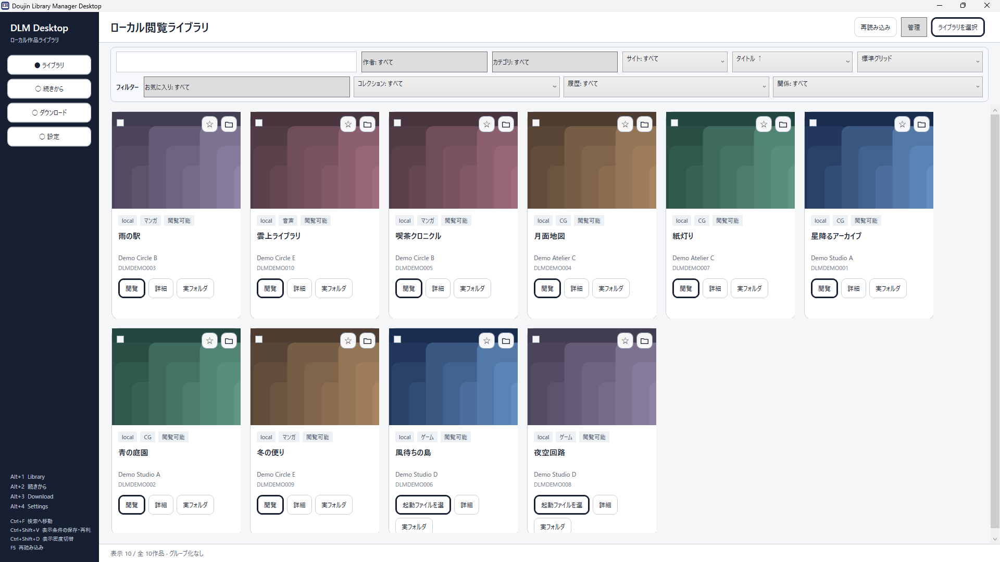
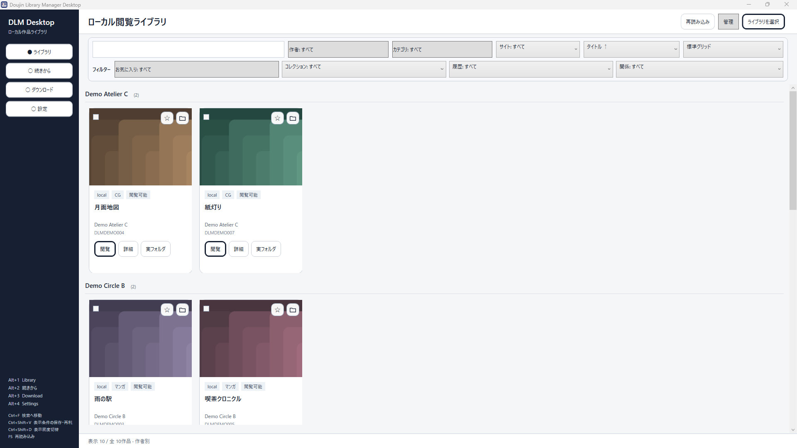
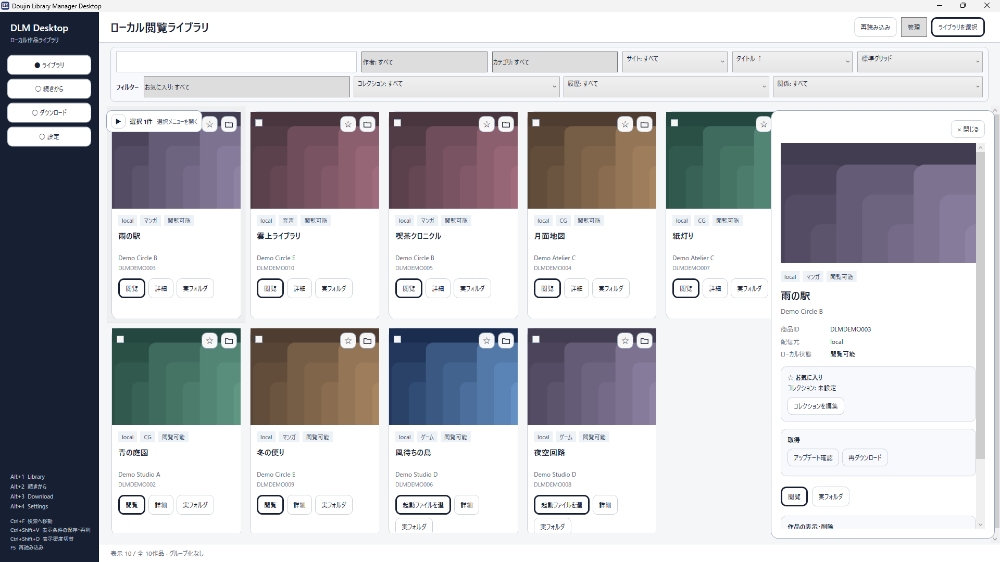
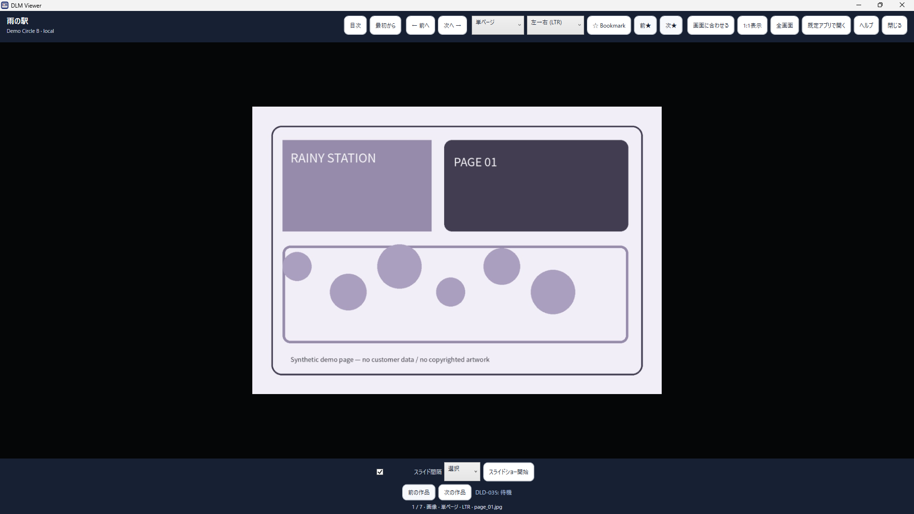
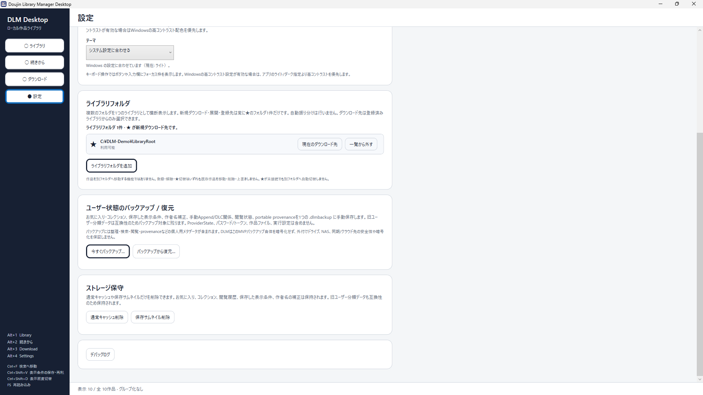

# DLM Desktop — Doujin Library Manager Desktop

**増えた同人・デジタル作品を、PC上でまとめて整理・閲覧するローカル中心のライブラリ。**

DLM Desktop is a local-first Windows library by Ertelun for organizing, finding, and viewing digital works you keep on your PC.

**Public Beta 2 · 日本語 / English · Windows x64 · ZIP · unsigned · by Ertelun**

[Public Beta 2をダウンロード / Download Public Beta 2](https://github.com/Ertelun/dlm-desktop/releases/tag/v0.1.0-beta.2)

配布元はこの公式Ertelun GitHub Releaseです。SHA-256はReleaseページとsidecarで確認できます。

The official Ertelun GitHub Release above is the canonical download source. Verify the SHA-256 shown on the Release page and in the checksum sidecar.

## Language / 言語

- UI language: **System / 日本語 / English**
- 言語設定の変更後はDLM Desktopを再起動して反映します。
- Changing the UI language requires restarting DLM Desktop.
- アプリのUI表示を切り替える機能であり、作品名・作者名・Provider由来メタデータを機械翻訳するものではありません。
- This setting localizes DLM UI chrome; work titles, creator names, and provider-supplied metadata remain in their original language.

## 主な機能 / Main features

- 登録済みローカルライブラリの整理・検索 / Organize and search registered local libraries
- 画像/PDF等の対応形式をローカル閲覧 / View supported local image/PDF content
- 閲覧位置の保存・再開 / Save and resume reading position
- DLMユーザー状態のBackup / Restore
- DLsite / DMM・FANZAの対応する通常ダウンロードでは、公式ページ上のユーザー操作後にアーカイブ検証とローカルライブラリ登録を支援
- For supported ordinary downloads from DLsite / DMM・FANZA, DLM assists with archive validation and local-library registration after the user performs the official-site login/download action

> **Public Beta 2では、任意の手元フォルダを新規作品として登録する standalone Manual Local Intake は提供しません。**
> **Public Beta 2 does not ship standalone Manual Local Intake for registering arbitrary local folders as new works.**
>
> 一部の既存Provider-handoff画面にはローカルフォルダ選択・検証の補助がありますが、それ自体は新規ローカル作品のLibrary登録を完了する機能ではありません。

## Screenshots

以下は公開用のsynthetic demo libraryです。顧客データ、購入履歴、実アカウント情報、著作権保護された作品画像は使用していません。

The screenshots use a synthetic demo library and contain no customer data, purchase history, real account information, or copyrighted work imagery.

### Library overview

<table>
<tr>
<td width="50%">

**作者別グルーピング / Creator grouping**

</td>
<td width="50%">

**作品詳細 / Work details**

</td>
</tr>
<tr>
<td width="50%">

**Viewer**

</td>
<td width="50%">

**Settings / Backup & Restore**

</td>
</tr>
</table>

## Public Beta

Public Beta 2は **Windows x64 / ZIP / unsigned** です。ARM64はPublic Beta 2の対象外です。

Public Beta 2 ships as an **unsigned Windows x64 ZIP**. ARM64 is not qualified for this Beta.

このPublic Betaはコード署名されていないため、WindowsでUnknown PublisherまたはMicrosoft Defender SmartScreenの警告が表示される場合があります。この公式Ertelun GitHub Releaseから取得したこととSHA-256を確認したうえで、実行するかをご判断ください。

Because this Beta is unsigned, Windows may show an Unknown Publisher or Microsoft Defender SmartScreen warning. Confirm that the package came from the official Ertelun GitHub Release and verify its SHA-256 before deciding whether to run it.

Current Public Beta 2 package SHA-256:

`66dd0661298a7f8bc906a29fc4e8f99a5406ea346989a936ab11737c76165272`

SHA-256の一致は公開した配布物とのbyte同一性確認であり、単独でソフトウェアの安全性を保証するものではありません。

A matching SHA-256 verifies byte identity with the published package; it does not by itself guarantee software safety.

大容量作品では、整合性検証・展開・物理コピー・最終SHA-256検証のため、Download完了後からLibrary登録まで数分以上かかる場合があります。Public Beta 2では最終整合性検証を省略していません。

## Provider-assisted acquisition

DLsite / DMM・FANZAの対応する通常ダウンロードでは、DLM内の公式ページでユーザー自身がログイン・Download操作を行い、その後のアーカイブ検証とローカルライブラリ登録をDLMが支援します。

For supported ordinary downloads from DLsite / DMM・FANZA, the user signs in and starts the official download on the provider page. DLM then assists with archive validation and local-library registration.

閲覧専用・公式プレイヤー専用・DRM管理・その他DLMが対応していない配信方式は、各サービスの公式手段をご利用ください。

Viewer-only, official-player-only, DRM-controlled, and other unsupported delivery modes remain on each provider's official route.

**DLM DesktopはErtelunによる独立したアプリケーションであり、DLsiteおよびDMM/FANZAの公式アプリ・提携製品ではありません。**

**DLM Desktop is an independent application by Ertelun and is not an official, affiliated, or endorsed application or product of DLsite, DMM, or FANZA.**

詳しくは [Provider Capabilities](PROVIDER_CAPABILITIES.md) と [Known Limitations](KNOWN_LIMITATIONS.md) を確認してください。

## Free Public Beta

Public Beta 2は無料です。DLM Coreのローカル利用に、支払い・DLMアカウント・サブスクリプションは必要ありません。

Public Beta 2 is free. Core local use does not require payment, a DLM account, or a subscription.

Public Beta 2では、支払い、PWYW、サブスクリプション、アプリ内広告、有料プロモーション、分析SDK/テレメトリSDKを有効化していません。

## Feedback / Security

公開Issueで受け付ける主なカテゴリは次の2つです。

- 既存機能の再現可能な不具合
- 既に対応しているDLsite / DMM・FANZAフローの互換性問題

Public issues are primarily for reproducible bugs in existing functionality and compatibility issues in already-supported DLsite / DMM・FANZA flows.

新機能要望・個別UX改善要望は、Public Betaでは原則として受付対象としていません。

- [Normal feedback / bug reports](https://github.com/Ertelun/dlm-desktop/issues)
- [Feedback guidance](FEEDBACK.md)
- [Security policy](SECURITY.md)
- [Privacy](PRIVACY.md)
- [Known Limitations](KNOWN_LIMITATIONS.md)
- [Release provenance](PROVENANCE.json)
- [Public Beta 2 r98 JA/EN release notes](RELEASE_NOTES-r98-JA-EN.md)

セキュリティ脆弱性は公開Issueへ投稿せず、GitHubの **Security → Report a vulnerability** からPrivate Vulnerability Reportingを使用してください。
